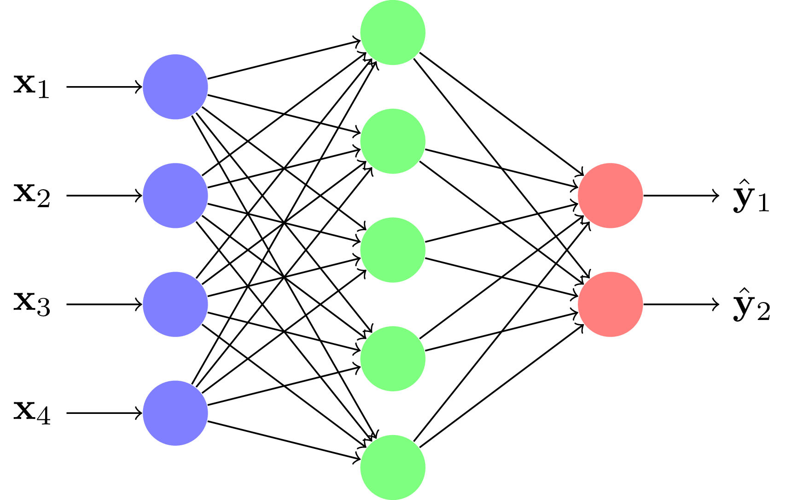
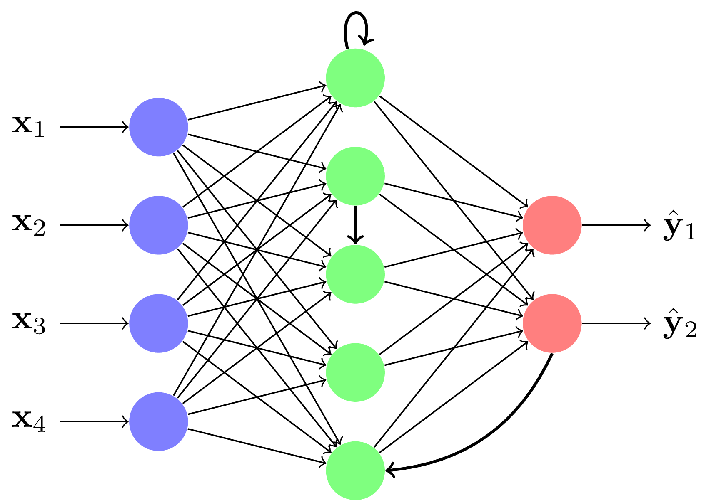

# Explorez les réseaux de neurones en couches

## Limitation du neurone formel

Un seul neurone ne permet pas de résoudre tous les problèmes

## Mettez plusieurs neurones en réseau

On peut associer plusieurs neurones formels en un réseau de neurones artificiels.

### Réseau multicouche

Un exemple souvent utilisé :

L'influx d'information va toujours des couches d'entrées aux couches de sorties. Ces réseaux peuvent être appris par descente de gradient. Ils sont adaptés aux données de tailles fixes, comme des images. Ils portent le nom de perceptron multicouche (PMC), Feed-Forward ou Multi Layer Perceptron (MLP) en anglais.

**note** :
Ce type de réseau s'apprend par un algorithme particulier, la rétropropagation du gradient.

### Réseau récurrent

Pour les données de tailles variables ou les séquences, on peut utiliser des réseaux récurrents où il existe au moins un neurone qui reboucle vers sa propre couche ou une couche précédente.

