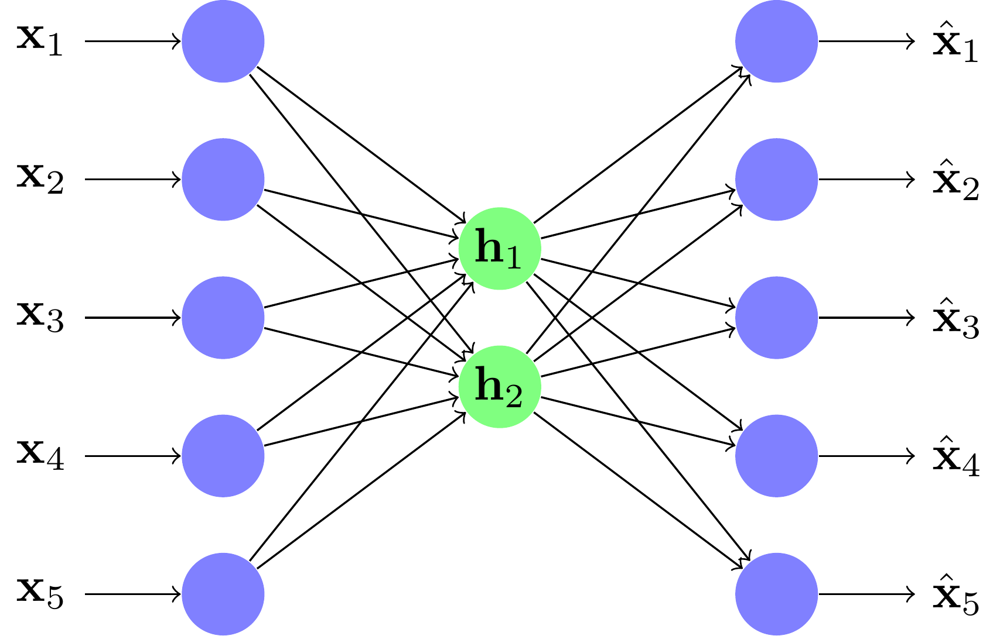

# Initiez-vous aux autoencodeurs (AE)
Il s'agit d'un type de réseau de neurones en couches . On l'appel encore réseau diabolo.
## Architecture diabolo

## Compression/décompression de données

Cette architecture peut être décomposée en deux parties :

- Un encodeur qui prend les données en grande dimension et les compresse vers une plus petite dimension

- un décodeur qui prend les données en petite dimension et les rétroprojette vers la plus grande dimension

- La valeur centrale h est appelée le code ; elle est censée contenir l'information de l'entrée de manière compressée.

## Apprentissage autoencoder
Il ajuste ses poids de manière standard grâce à la mesure de l'erreur de reconstruction et à la rétropropagation du gradient.

## Under/over complete
En fait, il existe deux types d'autoencodeur :

- les under-complete sont ceux dont les unités centrales sont en plus petit nombre que les unités d'entrée ; ils cherchent une réduction de dimension

-  les over-complete sont ceux dont les unités centrales sont en plus grand nombre que les unités d'entrée ; ils cherchent, eux, une meilleure représentation des données pour un traitement ultérieur

## Débruitage avec les autoencodeurs (under-complete)
On peut améliorer l'apprentissage des AE under-complete en rajoutant des perturbations à l'entrée

## Prévenir la coadaptation sur les autoencodeurs (over-complete)
On va déconnecter aléatoirement des neurones de la représentation intermédiaire pour éviter que le réseau ne se contente de recopier les informations de couches en couches.

## Réseaux profonds (données brutes vs caractéristiques)
Dans un apprentissage supervisé classique, on extrait d'abord des caractéristiques des données brutes.

Dans un apprentissage profond, on va directement travailler sur les données brutes. La phase d'extraction des caractéristiques est elle aussi apprise, et n'est plus statique.

## Exemple de construction de réseaux profonds grâce aux autoencodeurs

- On peut d'abord apprendre un autoencodeur sur une base de caractères.
- On garde l'encodeur comme première couche d'un réseau PMC classique, et on fixe ses paramètres.
**note** : On dit que la première couche du réseau a été préentraînée de manière non supervisée
-  On prend la sortie de l'encodeur et on l'apprend dans un nouvel autoencodeur.
- Et ainsi de suite...
- On finit l'apprentissage de toutes les couches (y compris la première) par un apprentissage supervisé classique appelé fine-tuning

On peut multiplier les couches préapprises et les couches du PMC pour des problèmes de grandes dimensions. On appelle alors `le réseau de neurones un réseau de neurones profond ou Deep Neural Network (DNN)`.

## Problématique du gradient évanescent liée aux réseaux profonds
Plus on rajoute de couches, plus l'apprentissage par rétropropagation du gradient est difficile.
