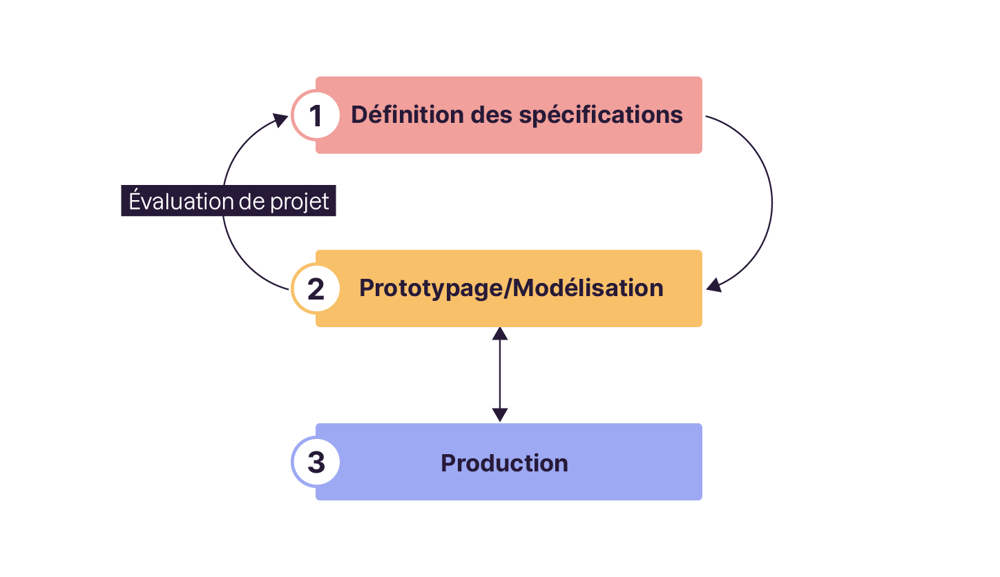

# Passez d’une problématique business à la mise en production

Un projet de Data Science a 3 grandes phases :

## Phase 1 – Définir les spécifications à partir de la problématique business

Cette phase a pour but de traduire une problématique business, un besoin ou un produit en projet Machine Learning. De façon très générique, il faut au minimum :

des données, qui soient pertinentes ;

un sujet ou un produit qui soit proprement défini ;

et montrer qu'il y a un net avantage à exploiter l'approche prédictive plutôt qu'une solution plus simple.

## Phase 2 – Concevoir le prototype et valider la faisabilité du projet

## Phase 3 – Mettre en production le projet

Le modèle une fois optimisé a vocation à être intégré dans le produit final : on parle de mise en production. C'est alors le travail des MLOps et des DevOps qui vont prendre en charge la mise en production dans le cloud ainsi que la surveillance des modèles.

“MLOps” est la contraction de DevOps (développement et opérations) et de ML. Le rôle du MLOps consiste à opérationnaliser les modèles de ML en production.

Pour bien comprendre l'importance de cette étape, pensez à la mise en production de centaines voire de milliers de modèles en parallèle, qui doivent être automatiquement :

- mis à jour ;

- ré)entraînés ;

- déployés ;

- surveillés.
